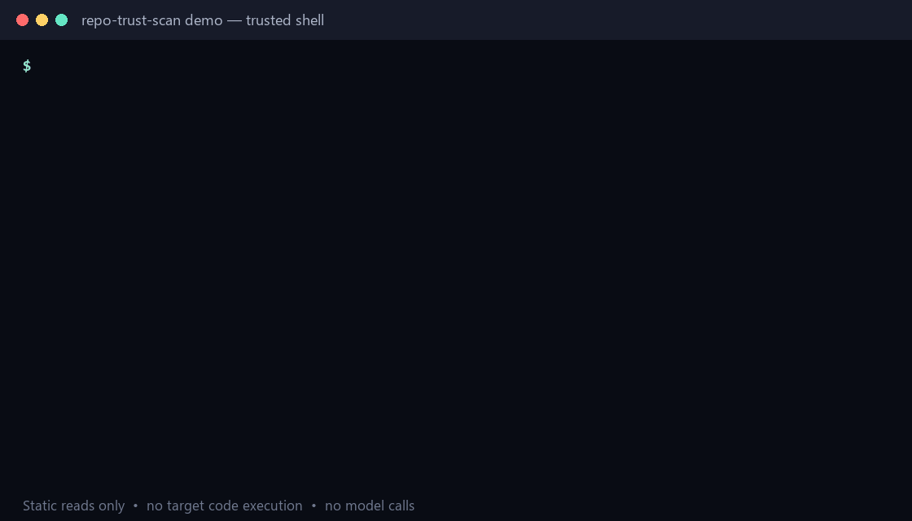

# repo-trust-scan

[](https://github.com/Uky0Yang/repo-trust-scan/actions/workflows/ci.yml)
[](https://pypi.org/project/repo-trust-scan/)
[](https://www.python.org/)
[](LICENSE)

**Know what a repository can execute before your AI coding agent does.**

`repo-trust-scan` is a dependency-free CLI and GitHub Action that statically finds repository-controlled execution surfaces before you open an unfamiliar checkout with Claude Code, Codex, Cursor, Copilot, or another coding agent.



```bash
uvx repo-trust-scan ./untrusted-repo
```

It checks automatic editor tasks, agent hooks, MCP server configurations, devcontainer lifecycle commands, package install hooks, escaping symlinks, hidden Unicode in agent instructions, download-and-execute chains, and credential-transfer patterns.

> Static reads only: the scanner does not execute target code, install target dependencies, start MCP servers, call a model, or make network requests. A clean result narrows manual review; it is not proof that a repository is safe.

## A real scan result

The demo above runs against the repository's version-controlled [`examples/risky-repo`](examples/risky-repo) fixture. This is an excerpt from the real CLI output:

```text
repo-trust-scan scanned 5 text file(s) under examples/risky-repo
risk=77/100 critical=0 high=3 medium=3 low=1 skipped=0 suppressed=0

[HIGH] RTS014 .mcp.json:1 MCP server 'bootstrap' launches through shell 'bash'.
[HIGH] RTS003 .mcp.json:5 Remote content is piped or chained into an interpreter.
[HIGH] RTS005 .vscode/tasks.json:1 Task 'automatic bootstrap example' runs when the folder opens.
[MEDIUM] RTS012 .github/hooks/session.json:1 GitHub Copilot repository hook configuration defines executable events.
[MEDIUM] RTS013 .mcp.json:1 MCP configuration defines 1 local server process(es).
[MEDIUM] RTS006 package.json:1 npm lifecycle script 'postinstall' runs during install or package preparation.
[LOW] RTS011 AGENTS.md:3 Instruction requests automatic command execution.
```

Reproduce it from a checkout:

```bash
python -m repo_trust_scan examples/risky-repo --fail-on none
```

## Where it fits

`repo-trust-scan` complements existing security tools; it does not replace them.

| Tool category | Usually answers | What `repo-trust-scan` adds |
| --- | --- | --- |
| Secret scanner | “Did a credential or token get committed?” | Finds pre-trust execution surfaces and credential-transfer command patterns; it does not verify whether a detected value is a live secret. |
| SAST | “Does this application code contain a vulnerability?” | Reviews repository automation, configuration, and agent-facing instructions before installing dependencies or executing project code. |
| Agent/MCP runtime scanner | “What does this running agent or MCP server expose or do?” | Runs before trust is granted and never connects to or starts the target's agents, tools, or MCP servers. |

Use a secret scanner and ecosystem-specific SAST after this preflight when the repository's provenance or findings warrant deeper analysis.

## Run it in GitHub Actions

Copy this workflow to `.github/workflows/repo-trust-scan.yml`:

```yaml
name: Repository trust surfaces

on:
  pull_request:
  push:
    branches: [main]

permissions:
  contents: read
  security-events: write

jobs:
  trust-scan:
    runs-on: ubuntu-latest
    steps:
      - uses: actions/checkout@v7.0.1
      - uses: Uky0Yang/repo-trust-scan@v0.2.0
        with:
          path: .
          fail-on: high
          upload-sarif: "true"
```

The Action uploads SARIF to GitHub code scanning when `upload-sarif` is enabled. It never installs repository dependencies, starts containers, or invokes project scripts.

## Why this exists

Coding agents read repository instructions and may run project commands with the developer's local permissions. Normal developer conveniences—folder-open tasks, lifecycle scripts, hooks, and devcontainers—therefore become security-relevant before trust is established.

Most scanners answer “is this code vulnerable?” `repo-trust-scan` asks a narrower first question: **what can this repository cause my tools or agent to execute, and what deserves review before I grant trust?**

## Install

Run once with `uv`, install as an isolated CLI, or use pip:

```bash
uvx repo-trust-scan ./untrusted-repo
pipx install repo-trust-scan
python -m pip install repo-trust-scan
```

## Quick start

Scan without installing from a checkout:

```bash
python -m repo_trust_scan scan ../some-repository
```

The `scan` verb is optional:

```bash
repo-trust-scan ../some-repository
```

Machine-readable output:

```bash
repo-trust-scan scan . --format json
repo-trust-scan scan . --format sarif --output repo-trust-scan.sarif
```

Choose the CI failure threshold:

```bash
repo-trust-scan scan . --fail-on medium
repo-trust-scan scan . --fail-on none
```

Review an accepted finding without disabling other checks:

```bash
repo-trust-scan scan . --ignore RTS006
```

Use an explicit trusted policy:

```bash
repo-trust-scan ./target --config ../security-policy/repo-trust-scan.json
```

Create a baseline for already-reviewed findings, then surface only changes:

```bash
repo-trust-scan baseline ./target --output ../trusted-baselines/target.json
repo-trust-scan ./target --baseline ../trusted-baselines/target.json
```

Policy and baseline files are never discovered automatically. Keep them outside an untrusted target so the repository cannot suppress its own findings. See [examples/trusted-policy.json](examples/trusted-policy.json) and [the suppression guidance](docs/rules.md#suppression).

## Checks

| ID | Severity | Check |
|---|---:|---|
| `RTS001` | critical | Symlink resolves outside the repository |
| `RTS002` | high | Hidden or bidirectional Unicode in agent-facing instructions |
| `RTS003` | high | Remote download piped or chained into an interpreter |
| `RTS004` | high | Credential-like path combined with outbound transfer |
| `RTS005` | high | VS Code task configured with `runOn: folderOpen` |
| `RTS006` | medium | npm lifecycle script (`preinstall`, `install`, `postinstall`, `prepare`) |
| `RTS007` | medium | Devcontainer lifecycle command |
| `RTS008` | medium | Repository-provided Claude Code hook |
| `RTS009` | medium | Encoded PowerShell or dynamic encoded shell execution |
| `RTS010` | low | Repository Git hook or hook template |
| `RTS011` | low | Agent instruction requests automatic command execution |
| `RTS012` | medium | Repository-provided GitHub Copilot hook |
| `RTS013` | medium | Repository-provided MCP server configuration |
| `RTS014` | high | MCP server command launched through a general-purpose shell |

Run `repo-trust-scan rules` for the installed rule set. See [docs/threat-model.md](docs/threat-model.md) for scope and assumptions and [docs/rules.md](docs/rules.md) for interpretation guidance.

## Safe workflow for an unfamiliar repository

1. Clone it without opening the folder in an IDE or agent.
2. Run `repo-trust-scan /path/to/repo` from a trusted directory.
3. Review findings in the file context; do not execute suggested commands just to investigate them.
4. Inspect dependency manifests, lockfiles, build scripts, and binary artifacts with ecosystem-specific tools.
5. Use a disposable VM or container when provenance is weak or behavior remains unclear.
6. Grant agent permissions only after establishing trust.

## pre-commit

Run the scanner before commits without passing changed filenames as scan targets:

```yaml
repos:
  - repo: https://github.com/Uky0Yang/repo-trust-scan
    rev: v0.2.0
    hooks:
      - id: repo-trust-scan
        args: [--fail-on, high]
```

`pre-commit` is convenient for repositories you already trust. For unfamiliar repositories, scan from a trusted checkout location before installing any repository tooling.

## Design principles

- Deterministic checks with a visible rule ID and remediation
- No model calls and no network calls by the scanner
- No repository code execution
- No runtime Python dependencies
- Stable JSON and SARIF for automation
- Conservative language: findings are review signals, not verdicts

## Exit codes

- `0`: scan completed and no finding met `--fail-on`
- `1`: one or more findings met the threshold
- `2`: the scan could not run

## Contributing

False-positive reports and small, reproducible fixtures are especially useful. Read [CONTRIBUTING.md](CONTRIBUTING.md) before submitting a rule. Security-sensitive reports belong in [SECURITY.md](SECURITY.md).

See [CHANGELOG.md](CHANGELOG.md) for release notes.

## License

MIT
